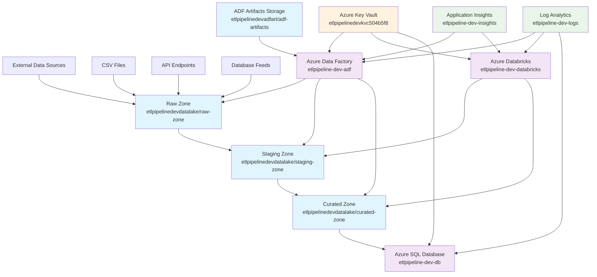
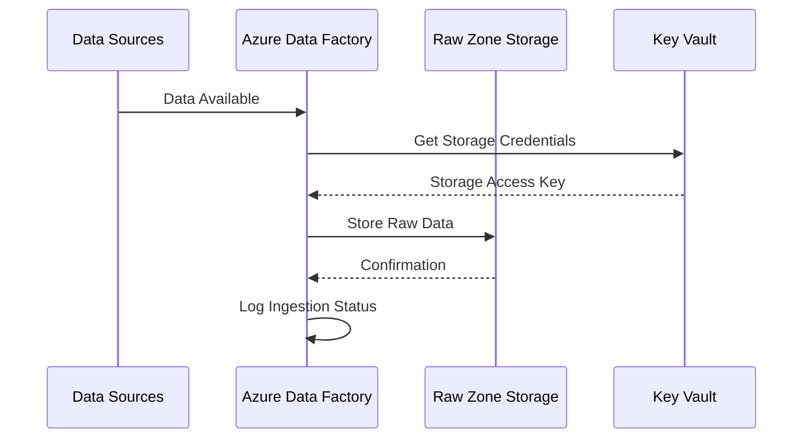
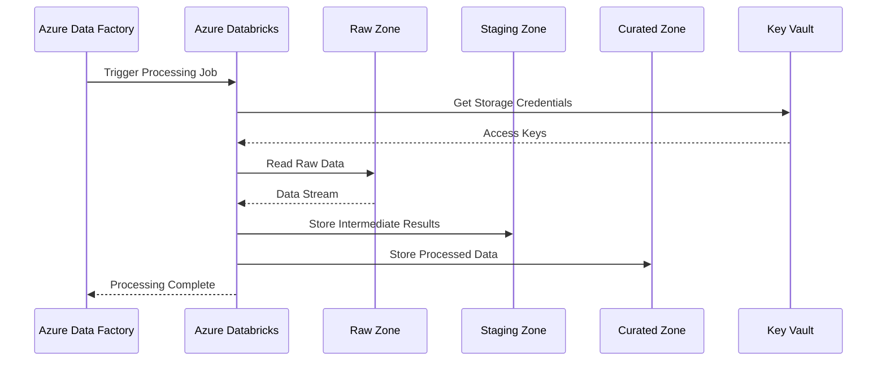
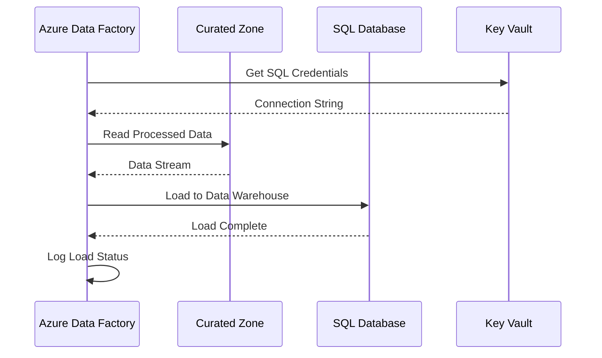
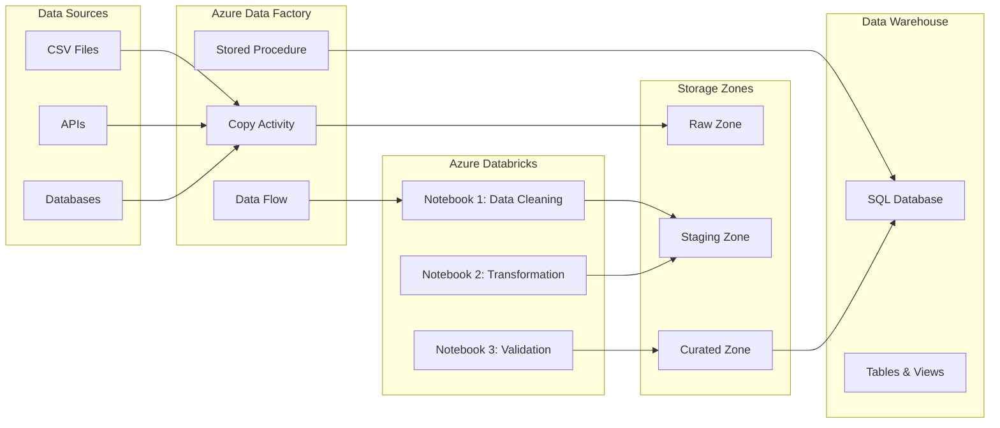
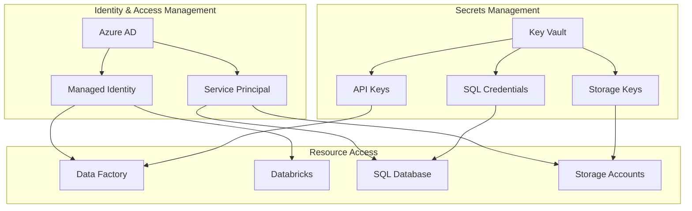
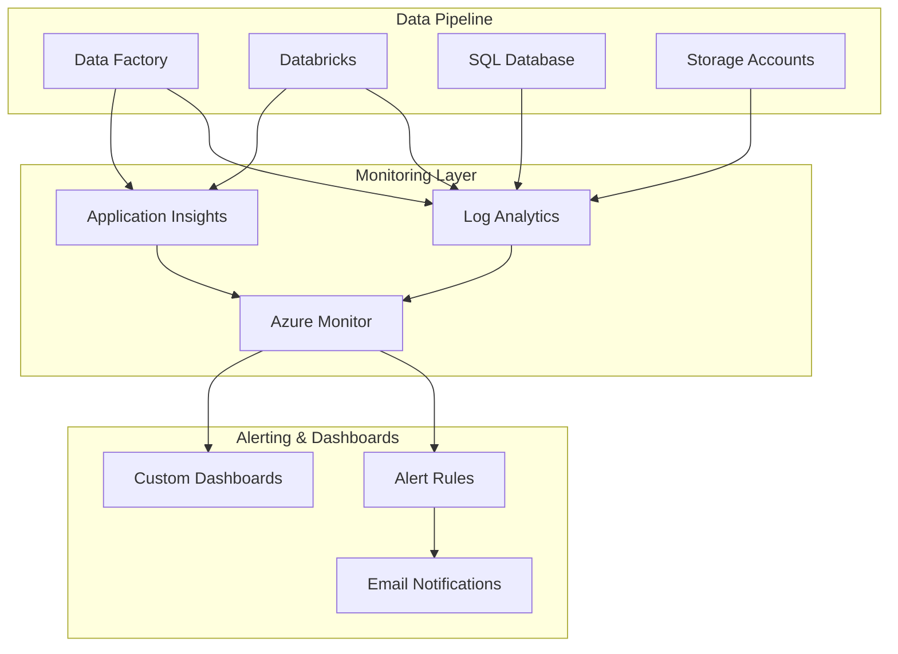
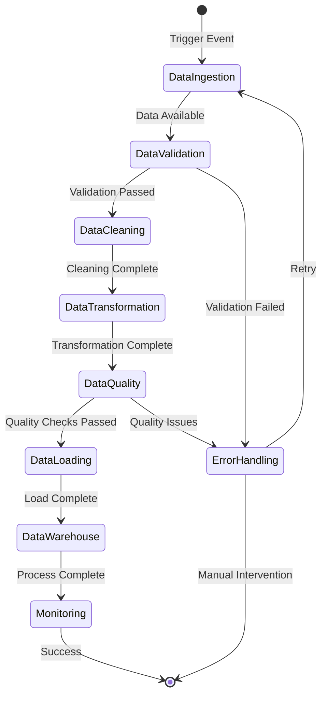

# Azure ETL Pipeline - Process Flow Diagram

## 🔄 ETL Pipeline Architecture Overview

## 📊 Detailed Process Flow

### **Phase 1: Data Ingestion**

### **Phase 2: Data Processing**

### **Phase 3: Data Loading**

## 🏗️ Infrastructure Components

### **Data Flow Architecture**

## 🔐 Security & Access Flow

### **Authentication & Authorization**

## 📈 Monitoring & Observability

### **Monitoring Stack**

## 🔄 Pipeline Execution Flow

### **End-to-End ETL Process**

## 📋 Pipeline Components

### **1. Data Ingestion Pipeline**
- **Trigger**: Scheduled (daily/hourly)
- **Source**: Multiple data sources
- **Destination**: Raw Zone Storage
- **Technology**: Azure Data Factory Copy Activity

### **2. Data Processing Pipeline**
- **Trigger**: Data Factory pipeline completion
- **Source**: Raw Zone Storage
- **Processing**: Databricks notebooks
- **Destination**: Staging → Curated Zone
- **Technology**: Azure Databricks + PySpark

### **3. Data Loading Pipeline**
- **Trigger**: Processing completion
- **Source**: Curated Zone Storage
- **Destination**: SQL Database
- **Technology**: Azure Data Factory + SQL Stored Procedures

### **4. Data Quality Pipeline**
- **Trigger**: After each transformation step
- **Purpose**: Data validation and quality checks
- **Technology**: Databricks + custom validation logic

## 🎯 Key Process Features

### **Data Lineage**
- **Raw Data**: Original format, unprocessed
- **Staging Data**: Cleaned and standardized
- **Curated Data**: Business-ready, validated
- **Warehouse Data**: Aggregated and optimized for analytics

### **Error Handling**
- **Retry Logic**: Automatic retry for transient failures
- **Dead Letter Queue**: Failed records for manual review
- **Alerting**: Real-time notifications for critical failures
- **Logging**: Comprehensive audit trail

### **Scalability**
- **Auto-scaling**: Databricks clusters scale based on workload
- **Parallel Processing**: Multiple data sources processed simultaneously
- **Partitioning**: Data partitioned by date and source for efficiency

---

## 📊 Performance Metrics

### **Expected Performance**
- **Data Ingestion**: 1-10 GB/hour depending on source
- **Processing Time**: 15-30 minutes for typical datasets
- **Data Loading**: 5-10 minutes for warehouse updates
- **End-to-End**: 30-60 minutes total pipeline execution

### **Monitoring KPIs**
- **Pipeline Success Rate**: >99%
- **Data Quality Score**: >95%
- **Processing Time**: <60 minutes
- **Error Rate**: <1%

---

*This process diagram represents the complete ETL pipeline architecture deployed in the Azure ETL Pipeline project, showing data flow, processing steps, and monitoring components.*
